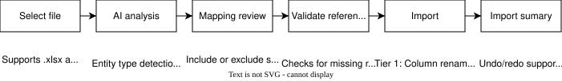

# AI Spreadsheet Import

Argo Books uses AI-powered analysis to import data from spreadsheets. The system automatically detects entity types, maps columns to the Argo Books schema, and handles complex data transformations. Users can import any spreadsheet in any format, in just a few clicks.

## Overview

## Supported File Formats

| Format | Extension | Details |
|--------|-----------|---------|
| **Excel Workbook** | `.xlsx` | Multi-sheet support, each sheet analyzed independently |
| **CSV** | `.csv` | Auto-detects delimiter (comma, tab, semicolon, pipe) |

## Import Pipeline

The import follows a five-step pipeline: analyze, review, validate, import, and categorize.

### Step 1: AI Analysis

The `SpreadsheetAnalysisService` reads the file and sends a summary to the Gemini API (via the argorobots.com server proxy) for analysis.

**Sampling strategy:** For large files, the service sends a representative sample to the LLM rather than all rows:
- First 5 rows
- Last 3 rows
- 5 random rows from the middle (deterministic seed for reproducibility)

The LLM receives the target schema (all entity types with their columns, types, and descriptions) alongside the source data, and returns a JSON response containing:
- **Entity type detection** per sheet with confidence scores
- **Column mappings** from source columns to target columns with per-mapping confidence
- **Processing tier** recommendation (Tier 1 or Tier 2)
- **Unmapped columns** in both directions (source and target)

**Country-aware schemas:** Address fields adapt to the user's country. For example, US users see "State" and "ZIP Code" while UK users see "County" and "Postcode".

### Step 2: Mapping Review

The `ImportMappingDialog` presents the AI analysis for user review before import proceeds. Users can:

- **Include/exclude** individual sheets from the import
- **Review** column mappings and confidence scores
- **Toggle** whether existing records should be skipped or overwritten
- **View** rate limit usage (remaining imports this month)

### Step 3: Validation

Before importing, the system validates the mapped data against the existing company data:

- **Missing references:** Detects when imported data references entities that don't exist (e.g., an invoice referencing a customer ID that isn't in the system)
- **Auto-fixable issues:** Missing suppliers, customers, categories, and other reference entities can be automatically created as placeholders
- **Non-auto-fixable issues:** Invalid data that requires the user to fix the spreadsheet

The `ImportValidationDialog` presents issues grouped by sheet and lets the user choose to:
- Cancel the import
- Auto-create missing references and import

### Step 4: Import (Two Processing Tiers)

The system uses two processing tiers depending on data complexity.

#### Tier 1: Direct Column Mapping

Used when the source data structure closely matches the target schema: columns just need renaming.

- Source column headers are renamed to match the Argo Books schema based on the AI's column mappings
- Standard import logic then processes the renamed data deterministically
- No additional LLM calls are needed

**When Tier 1 is used:**
- Simple renamed columns (e.g., "Client Name" → "Name")
- Different terminology but same structure
- Minor format differences

#### Tier 2: LLM Row Processing

Used when the data requires complex transformation that simple column mapping cannot handle.

- All rows are read from the sheet
- Rows are split into chunks of 100 rows each
- Chunks are processed in parallel (up to 10 concurrent LLM calls)
- The LLM normalizes each chunk into structured JSON matching the target schema
- Entities are deduplicated across chunks (last occurrence wins on ID conflicts)
- Results are imported sequentially (CompanyData mutation is not thread-safe)

**When Tier 2 is used:**
- Multiple entity types mixed in one sheet
- Rows that need grouping (e.g., line-item-per-row invoices)
- Pivot tables, cross-tabs, or non-tabular layouts
- Data requiring non-trivial column splitting/combining

The LLM is instructed to:
- Generate reasonable IDs when none exist
- Parse dates to ISO 8601 format
- Parse decimal amounts (removing currency symbols, handling regional separators)
- Skip subtotal rows, repeated headers, and empty rows
- Group multiple source rows into single entities when appropriate

### Step 5: AI Product Categorization

After import completes, any products that lack a category are sent through AI categorization. The LLM infers appropriate category names from the product name and description (e.g., "Industrial Drill Press" → "Power Tools").

## Fallback: AI Rescue for Unrecognized Files

When Step 1 analysis cannot classify a file at all (it returns no usable sheets), the import no longer dead-ends. It automatically runs a heavier whole-file rescue pass (`SpreadsheetAnalysisService.RescueAsync`) that either extracts records or explains, in vetted wording, why the file cannot be imported.

Unlike Step 1, which samples ~13 rows to classify, the rescue reads every sheet in full and asks the LLM, per sheet, to make one of two decisions:

- **Extract:** the sheet holds individual, one-per-row records. The LLM picks the single best-fit entity type (any supported `SpreadsheetSheetType`, including bank statements), and the sheet is normalized through the existing Tier 2 path and committed. Bank statement rows route to Bank Matching, exactly as in the normal flow.
- **Reject:** the sheet cannot be represented as Argo Books records. The LLM returns a fixed reason code, never free text, so the user always sees curated copy.

**Rejection reason codes**

| Code | Shown when |
|------|-----------|
| `SummaryOrReport` | The file is a summary or report of category totals (e.g. a QuickBooks Profit and Loss statement), not individual records |
| `NotArgoData` | Nothing in the file matches data Argo Books tracks |
| `UnsupportedStructure` | It looks like records but the layout cannot be mapped (also the default for an unrecognized code) |
| `EmptyOrUnreadable` | No readable data rows |
| `TooLarge` | Over the row cap (see Limits below); set by a row-count guard, not by the AI |

The application owns the user-facing text (`ImportRescueMessages.ForReason`); an unrecognized or malformed AI response falls back to the `UnsupportedStructure` message. A file read failure is reported as a friendly `EmptyOrUnreadable` rejection (and still logged) rather than surfacing a raw exception.

**Limits**

Because rows are processed in batches, file size is an operational limit (time and number of AI calls), not a model limit:

- **Hard cap: 10,000 total rows.** Over the cap, the file is rejected as `TooLarge` before any AI call is made.
- **Warning over 1,000 rows.** Large but allowed files show a "this may take a while" message before the AI runs.
- **Width-aware batching.** For wide sheets, the extraction batch shrinks below 100 rows (targeting roughly 2,500 cells per batch) so a response is not truncated.

**Usage:** a rescue counts as one AI import only when it actually extracts records; a rejected file is not charged. The normal monthly quota check still runs before the rescue.

## Rate Limiting

AI imports are rate-limited via a server-side monthly quota.

The `AiImportUsageService` tracks usage per license key via a server-side API (`argorobots.com/api/ai-import/usage.php`).

| Behavior | Detail |
|----------|--------|
| Checked before each import | Cached for 5 minutes to reduce API calls |
| Quota exceeded | Import blocked with reset date shown |
| Server unreachable | Import allowed if cached data shows remaining quota |
| Network offline | Import allowed if cache indicates capacity |
| After successful import | Usage count incremented via API |

### Orchestration

The full import flow is orchestrated by `PerformAiImportAsync` in `ArgoBooks/App.axaml.cs`. This method coordinates all services, dialogs, progress reporting, undo/redo snapshots, and telemetry tracking.
