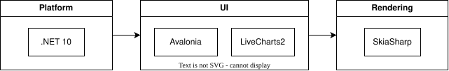
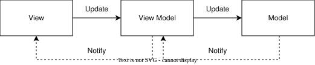

# Architecture Overview

Argo Books is a cross-platform desktop accounting application built with modern .NET
technologies, with an Android companion app for capturing receipts away from the desk.

## Technology Stack

| Layer | Technology | Description |
|-------|------------|-------------|
| **Platform** | [.NET 10](https://dotnet.microsoft.com/en-us/) | Core runtime and framework |
| **UI Framework** | [Avalonia](https://avaloniaui.net/) | Cross-platform XAML-based UI |
| **Charts** | [LiveCharts2](https://livecharts.dev/) | Interactive data visualization |
| **Rendering** | [SkiaSharp](https://github.com/mono/SkiaSharp) | 2D graphics engine |

## MVVM Architecture

The application follows the [Model-View-ViewModel (MVVM)](https://docs.avaloniaui.net/docs/concepts/the-mvvm-pattern/) pattern for clean separation of concerns.

- **View** - XAML UI definitions and controls
- **ViewModel** - Presentation logic and state management
- **Model** - Business entities and data structures

## Project Contents

| Project | Contents |
|---------|----------|
| **ArgoBooks** | Views, ViewModels, Controls, Modals, UI Services |
| **ArgoBooks.Core** | Models, Business Services, Data, Platform |
| **ArgoBooks.Shared** | Code shared between desktop and mobile: Security (encryption, key derivation), Sync, Receipts, Telemetry |
| **ArgoBooks.Desktop** | Desktop entry point (Windows/macOS/Linux) |
| **ArgoBooks.Mobile** | Android companion app: receipt capture, scan review, read-only snapshot viewing |
| **ArgoBooks.Tests** | Unit tests (xUnit) |
| **ArgoBooks.Translations** | Offline tool that generates language files via Azure Translator |

`ArgoBooks.Shared` is referenced by `ArgoBooks.Core`, so its types live in the `ArgoBooks.Core.*`
namespaces despite sitting in a separate project. Anything the phone and the desktop both need,
in particular the encryption used on company files, belongs there rather than in Core.

The recovery tool at `tools/ArgoBooks.Recovery` is deliberately **outside** the solution so it
can never be built into or shipped with the app. See [Password recovery](../tools/ArgoBooks.Recovery/README.md).

## Design Principles

1. **MVVM Pattern** - Clear separation between Views, ViewModels, and Models
2. **Service-Oriented** - Business logic encapsulated in dedicated services
3. **Cross-Platform** - Single codebase targets Windows, macOS, Linux, and Android
4. **In-Memory Data** - Fast operations with full data loaded in memory
5. **File-Based Storage** - Portable `.argo` files instead of database
6. **Compiled Bindings** - Performance-optimized data binding
7. **Singleton Services** - App-wide service instances via dependency injection
