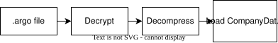
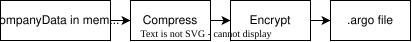
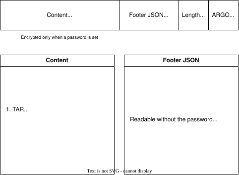

# Data Storage

Argo Books uses a file-based storage system with portable `.argo` files instead of a traditional
database. Files are encrypted once the user sets a password; without one they are compressed but
not encrypted.

## CompanyManager

Central orchestrator for all company file operations.

- Company file lifecycle management
- Temporary directory management
- Save/load coordination
- Encryption coordination
- Auto-save functionality
- File locking

### CompanyManager Operations

Load File:



Save File:



## `.argo` File Format

A company is a directory of JSON files and attachments. Saving packs that directory into a TAR
archive, GZip compresses it, optionally encrypts it, and appends a metadata footer:

```
[ content: gzip(tar(company directory)), encrypted if a password is set ]
[ footer JSON (UTF-8, plaintext)                                        ]
[ footer length (4 bytes, little-endian)                                ]
[ magic bytes "ARGO"                                                    ]
```

Opening reads the trailer backwards: magic bytes, then length, then the footer, and only then
the content. That is why the footer can never be encrypted, it holds the parameters needed to
begin decrypting.



### Format versions

| Version | Layout |
|---|---|
| **1** | The archive is encrypted directly with the password-derived key |
| **2** | Envelope encryption. A random data key encrypts the archive, and that key is stored wrapped under the password and, separately, under the recovery key |

Version 2 arrived in 2.0.11. Version 1 files still open on their original code path and are
upgraded the next time they are saved. Files written at version 2 cannot be opened by older
builds, so `FileService` checks the footer's format version **before** attempting any decryption
and reports an out-of-date app rather than a misleading wrong-password error.

See [Security](Security.md) for the key derivation and envelope details, and
[Password recovery](../tools/ArgoBooks.Recovery/README.md) for the support-side unlock path.

### Footer contents

The footer is plaintext JSON. It carries the metadata needed to list a company without opening
it (name, accountants, timestamps, logo thumbnail, app and format version), plus the encryption
parameters (salt, nonce, password verification hash) and the wrapped data keys. The wrapped keys
are themselves ciphertext; the parameters alongside them are not secrets.

No financial data is recoverable from the footer.

## Global Settings

Application-wide settings stored separately.

- Recent files list
- User preferences
- Application state persistence

## Benefits of File-Based Storage

| Benefit | Description |
|---------|-------------|
| **Portability** | Files can be copied, emailed, backed up easily |
| **No Database** | No server or database installation required |
| **Performance** | All data in memory = fast operations |
| **Privacy** | Data stays local, encrypted on disk |
| **Simplicity** | Single file per company |
