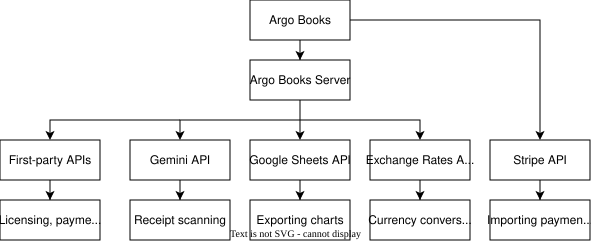
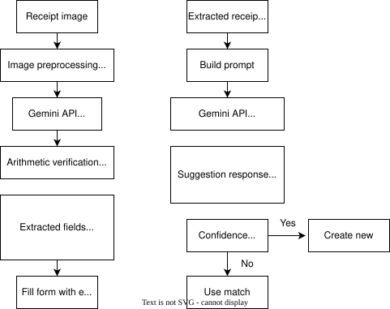
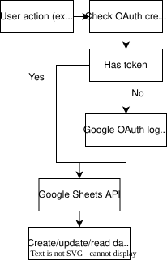
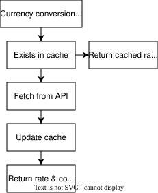

# Integrations

Argo Books integrates with external services to provide AI-powered features and real-time data.

## Overview

## Argo Books Server

`argorobots.com` hosts a PHP backend that sits between the desktop app and every external service it touches. It plays two distinct roles:

1. **Proxy** for third-party services. The app never talks to Gemini, Google, or the Exchange Rates provider directly; every call is mediated by the server. This centralizes API keys, cost tracking, and per-license quota enforcement.
2. **First-party API host** for functionality that has no upstream service: licensing, quota counters, payment-portal customer flows, transactional emails, and more.

### Third-party services proxied through the server

| Service | What the server proxies |
|---|---|
| Google Gemini | Receipt OCR, supplier/category matching, AI spreadsheet import. See [ReceiptScanning](ReceiptScanning.md) and [AISpreadsheetImport](AISpreadsheetImport.md). |
| Google OAuth & Sheets | Sign-in-with-Google flow and chart export to Google Sheets. |
| Exchange rate provider | Cached real-time and historical USD-base rates. |

### First-party server APIs

| Category | Purpose |
|---|---|
| License & subscription | Validate license keys, redeem purchased keys, fetch live pricing. See [LicenseKey](LicenseKey.md). |
| Usage quotas | Per-license monthly counters for receipt scans, AI imports, and published invoices. |
| Invoice email | Server-side delivery of invoice emails to customers. |
| Payment portal | Customer-facing refund requests, email verification, and email-change confirmations. See [PaymentPortal](PaymentPortal.md). |

### Services the app calls directly

Stripe is the exception to the proxy rule. The app talks to `api.stripe.com` itself, using a
restricted API key the merchant creates in their own Stripe dashboard and pastes into Settings.
Nothing routes through `argorobots.com`, and Argo Books never holds the merchant's Stripe
credentials.

| Service | Called by | Credentials |
|---|---|---|
| Stripe | `StripeApiClient` | The merchant's own restricted key, entered in Settings |

The key is stored in the company file's settings under `integrations.stripe.apiKey`, so it is
protected by the same encryption as everything else in the file, meaning it is only encrypted if
the file has a password. See [Security](Security.md).

Endpoints follow a stable category-prefix pattern (`/api/<area>/<action>.php`). Specific URLs are scattered across the relevant Core services; treat the tables above as the authoritative list of integration surfaces, not the individual endpoints.

Most endpoints authenticate via the user's license key in an `Authorization: Bearer` header plus an `X-Device-Id` header. The customer payment portal is the exception: it uses short-lived email-delivered codes, because end-customers do not have a license.

## Google Gemini Integration

AI-powered receipt scanning via Gemini 2.5 Flash vision, plus supplier and category matching for receipt processing.

## Google Sheets Integration

Export charts to Google Sheets.

## Exchange Rate Service

Real-time currency conversion.

## Stripe Integration

Imports payments taken through Stripe so they do not have to be entered by hand. Added in
2.0.11. Requires a restricted key with read access to Balance transactions, Charges and Payouts.

| Piece | Role |
|---|---|
| `StripeApiClient` | Talks to the Stripe REST API, with pagination and key validation |
| `StripeSyncService` | Fetches balance transactions since the last sync and builds a preview |
| `StripeDetailImporter` | Expands each charge into a sale, creating the product and customer if needed |
| `StripeImportCreation` | Applies the import as a single undo/redo action |

Behaviour worth knowing:

- **Sales carry their full detail.** Tax, discounts and Stripe's processing fee all come across,
  rather than a single net figure.
- **Refunds become returns** against the original sale, with a duplicate guard on the fallback
  refund expense.
- **Re-syncing does not duplicate.** The last imported charge id is kept as a cursor, so a sync
  only fetches what came after it.
- **Payouts are remembered** in `importedPayouts`. When a bank statement is later imported,
  `BankMatchingService` auto-ignores a deposit whose amount is within 1 cent or 1% and whose
  date falls inside the match window, so the Stripe deposit is not counted on top of the sales
  already imported from Stripe.
