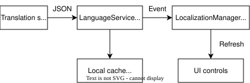
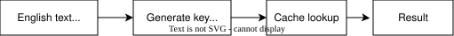
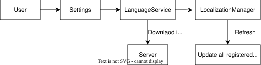
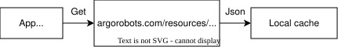

# Localization

Argo Books supports multiple languages through a dynamic translation system that downloads and caches translations from the server. You can view the list of supported languages on the website [here](https://www.argorobots.com/documentation/pages/reference/supported_languages.php).

## Overview



## XAML Usage

Translations are applied in XAML using the `{loc:Loc}` markup extension:

```xml
<TextBlock Text="{loc:Loc 'Save Changes'}" />
<Button Content="{loc:Loc 'Cancel'}" />
```

For strings containing apostrophes, escape them by doubling:

```xml
<TextBlock Text="{loc:Loc 'Don''t save'}" />
```

### TranslateConverter

For data binding scenarios (e.g., ItemTemplates), use `TranslateConverter`:

```xml
<ComboBox ItemsSource="{Binding Options}">
    <ComboBox.ItemTemplate>
        <DataTemplate>
            <TextBlock Text="{Binding Converter={StaticResource TranslateConverter}}" />
        </DataTemplate>
    </ComboBox.ItemTemplate>
</ComboBox>
```

## Code Usage

### Loc.Tr() (Static Helper)

```csharp
using ArgoBooks.Localization;

var message = Loc.Tr("Operation completed successfully");
var formatted = Loc.Tr("Saved {0} items", count);

// Check current language
if (Loc.IsEnglish) { /* ... */ }
var isoCode = Loc.CurrentIsoCode;  // e.g., "fr"
var name = Loc.CurrentLanguage;     // e.g., "French"
```

## Translation Flow



1. **English text** is provided in XAML or code
2. **Key generation** converts text to a lookup key (`str_savechanges`)
3. **Cache lookup** finds the translation for the current language
4. **Result** is returned (or original text if no translation exists)

English is looked up too, against the cached `en.json`, rather than being passed straight through. For a key with no collision that returns the same text it was given. When two strings share a key it returns the other one, which is how a stale `en.json` shows text that no longer appears anywhere in the source. Rebuild it with `--languages en` after changing English strings.

### Key Generation

Translation keys are generated from the English text:
- Convert to lowercase
- Remove special characters (except `{0}` placeholders)
- Prefix with `str_`
- Truncate to 50 characters max

Example: `"Save Changes"` → `str_savechanges`

**Note:** This means `"Save Changes"` and `"save changes"` produce the same key. Avoid duplicate strings that differ only in case or punctuation.

## Language Change Flow



1. **User** selects a new language in Settings
2. **Settings** calls `LanguageService.SetLanguageAsync()`
3. **LanguageService** downloads translations if not cached, then fires `LanguageChanged` event
4. **LocalizationManager** receives the event
5. **UI Update** refreshes all registered bindings with new translations

## Translation Download



Translations are downloaded from the server based on app version:

```
https://argorobots.com/resources/downloads/{version}/languages/{isoCode}.json
```

### Caching

Downloaded translations are cached locally:

| Platform | Cache Location |
|----------|----------------|
| **Windows** | `%LOCALAPPDATA%\ArgoBooks\Languages\` |
| **macOS** | `~/Library/Caches/ArgoBooks/Languages/` |
| **Linux** | `~/.cache/ArgoBooks/Languages/` |

Cache files:
- `translations.json` - All non-English translations
- `en.json` - English translations
- `{isoCode}.json` - Individual language files (optional)

## Translation Generation (Admin)

Translations are generated using the `TranslationGenerator` class and the **Azure Translator API**.

### Running the Translation Tool

In **JetBrains Rider**, set the startup project to `ArgoBooks.TranslationTool`, then run it.

Or use the command line:

```powershell
# Set environment variables
$env:AZURE_TRANSLATOR_REGION = "canadacentral"
$env:AZURE_TRANSLATOR_KEY = "your-api-key"

cd ArgoBooks.TranslationTool
```

| Command | Description |
|---------|-------------|
| `dotnet run -- --languages en` | Rebuild `en.json` and report key collisions, nothing else. No API calls, no key needed |
| `dotnet run -- --translate` | Translate to all languages |
| `dotnet run -- --languages fr,de,es,ja` | Translate to specific languages |
| `dotnet run -- --output C:\MyTranslations` | Custom output directory |

Output files are saved to `./languages/` by default (e.g., `en.json`, `fr.json`).

**`en.json` is rebuilt from source on every run**, whatever the arguments, because it is written before the tool decides which languages to translate. The other language files are only touched when a non-English language is selected.

`--languages en` is therefore the way to apply an English-only change: English is skipped by the translation loop, so the run rebuilds `en.json`, reports "Nothing to do", and exits without reading the API key or opening any other language file.

**Run `--languages en` after changing any English string.** English is not read from the source text at runtime, it is read from `en.json` (see [Translation Flow](#translation-flow)), so editing a `{loc:Loc}` string in XAML has no visible effect until the file is rebuilt. It is free, so there is no reason to skip it.

**For incremental translation:** Copy existing translation files to the output folder first. The tool skips any key already present with a non-empty value, avoiding redundant API calls.

### How It Works

1. **Scan source files** - Collects all translatable strings from AXAML, then C#. AXAML is scanned first, which matters for collisions (see below)
2. **Write `en.json`** - Rebuilt from scratch from the collected strings
3. **Compare with existing** - For each target language, any key already present with a non-empty value is reused as-is; only the remainder is sent for translation
4. **Translate via Azure** - Sends the untranslated strings to Azure Translator API in batches
5. **Save JSON files** - Outputs `{isoCode}.json` files for each language

This avoids re-translating existing content, saving API costs and preserving any manual translation fixes.

Because step 3 keys off the key and not the English text, **changing only the capitalization of a string costs nothing**: the key is lowercased before it is built, so the existing translation stays attached.

**Limitations:** Key collisions can cause issues:
- `"Save Changes"` and `"Save changes"` both produce key `str_savechanges`
- `"Supplier"` and `"Supplier..."` do too, because punctuation is stripped
- Keys are truncated to 50 characters, so only the first 50 chars affect the key

To force a re-translation of one key, delete it from the target language file (`fr.json` and so on) and re-run `--translate`. Deleting it from `en.json` does nothing, since that file is rebuilt from source every run.

**Workaround for casing:** Instead of creating separate translations for different cases, translate once and transform in code:

```csharp
var upper = Loc.Tr("Save Changes").ToUpperInvariant();
```

Or use `UpperCaseConverter` in XAML for UI elements that need all caps.

## Avoiding key collisions

Two source strings that reduce to the same key cannot both exist. The collector keeps whichever it scanned first and silently discards the rest, so the wrong text can appear anywhere the key is used. A label reading `Supplier...` in a table header is the classic symptom.

Scan order decides the winner: **all AXAML files are read before any C# file.** A `{loc:Loc}` string therefore always beats a colliding C# literal, which is why UI text is safe from strings that exist only as spreadsheet column names or import aliases.

Every run prints a collision report, but **do not rely on it for this class of problem.** It only lists collisions where the variants still differ after lowercasing and stripping punctuation, which is aimed at the 50-character truncation case where two unrelated strings merge. Case-only and punctuation-only variants are treated as "benign" and collapsed into a single suppressed count, on the assumption that they share one sensible translation. That assumption holds for a menu item and breaks for a table header, so these have to be caught by reading the report's benign count and investigating, or by checking the rendered UI.

### Capitalization

Sentence case. Capitalize the first word only, and leave the rest lowercase:

> Clear all, Sync now, Street address, Units sold

Proper nouns and acronyms keep their capitals (`Argo Books`, `Stripe`, `PDF`, `GST/HST`). Because the key is lowercased before it is built, fixing capitalization never changes the key and never costs a re-translation.

### Punctuation

Keep punctuation out of the translated string. Translate the word, then add the punctuation as a separate `Run`:

```xml
<!-- Instead of Text="{loc:Loc 'Quantity:'}" which collides with 'Quantity' -->
<TextBlock><Run Text="{loc:Loc 'Quantity'}" /><Run Text=":" /></TextBlock>
```

Only the `Run` carrying `{loc:Loc}` is translated. The other is literal text and never reaches the translator, which is correct: `:`, `...`, `#` and `($)` are the same in every language. Renders identically to a single `Text` attribute.

This works wherever the text is the content of a `TextBlock`. It does **not** work when the string sits in an attribute, such as `ToolTip.Tip`, `Placeholder`, `PlaceholderText` or a custom control's `Header`. There, either drop the punctuation or reuse an existing distinct string (`Select category...` rather than `Category...`).

## Translation File Format

Translation files are simple JSON key-value pairs:

```json
{
  "str_savechanges": "Enregistrer les modifications",
  "str_cancel": "Annuler",
  "str_saved0items": "Enregistré {0} éléments"
}
```

## Best Practices

| Practice | Description |
|----------|-------------|
| **Use markup extension** | Prefer `{loc:Loc 'text'}` over code translations for automatic refresh |
| **Use TranslateConverter for templates** | Required for translating bound data in ItemTemplates |
| **Keep text short** | Long keys are truncated; keep source text concise |
| **Use placeholders** | Use `{0}`, `{1}` for dynamic values: `Loc.Tr("Found {0} results", count)` |
| **Avoid concatenation** | Don't join two translated strings; use full sentences with placeholders. Appending non-translatable punctuation via a second `Run` is fine and is the preferred fix for `Label:` |
| **Avoid case-only variants** | `"Save"` and `"SAVE"` produce the same key; use one consistently |
| **Use sentence case** | Capitalize the first word only, except proper nouns and acronyms |
| **Rebuild after editing English** | Run `--languages en`, or the change won't show |