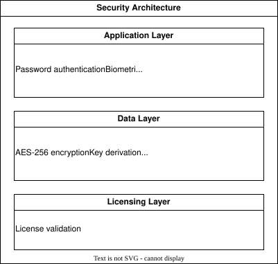
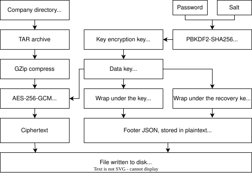
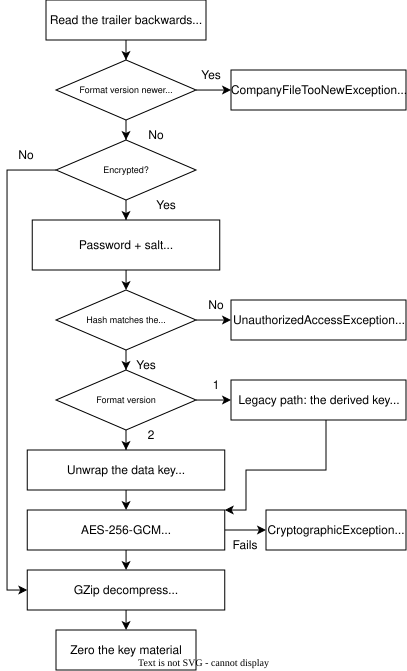
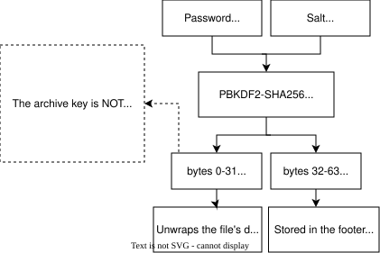
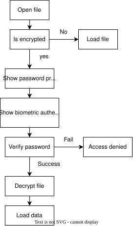

# Security

Argo Books implements multiple layers of security to protect sensitive business data.

## Overview

## When a file is encrypted

**Encryption is switched on by setting a password.** The password is what the key material is
built from, so a company file with no password is not encrypted at all: it is a TAR archive,
GZip compressed, with a metadata footer appended. Anyone holding that file can read it.

Once a password is set, every subsequent save encrypts the whole archive.

## Encryption service

AES-256-GCM over the entire compressed archive, so there is no per-field selection to get
wrong. GCM is authenticated, so a tampered file fails to decrypt rather than returning altered
data.

- AES-256-GCM
- 96-bit random nonce per save
- 128-bit authentication tag
- Key material zeroed from memory immediately after use

### Encryption flow

### Decryption flow

## Key derivation

PBKDF2-SHA256 turns the password into key material. A single pass produces a 64-byte master
key, split into two halves that are never used for the same purpose:

| Bytes | Use |
|---|---|
| 0 to 31 | Key encryption key, which unwraps the file's data key |
| 32 to 63 | Verification hash, stored in the footer to tell a wrong password from a corrupt file |

- 600,000 iterations, meeting the OWASP recommendation for SHA-256
- 256-bit random salt per save
- Deriving both halves in one pass avoids running PBKDF2 twice per save

### Key derivation process

## Envelope encryption (format version 2)

From version 2.0.11 the archive is **not** encrypted directly with the password-derived key.
Instead:

1. A random 256-bit data key encrypts the archive.
2. That data key is stored in the footer twice: wrapped under the password-derived key
   encryption key, and wrapped under the Argo Books recovery public key (RSA-4096, OAEP-SHA256).

Either wrap yields the same data key, so the archive is encrypted only once regardless of how
many unlock paths exist. Adding a path later costs a footer field and never requires
re-encrypting user data, and changing a password becomes a rewrap rather than a full rewrite.

This is what makes support-side recovery possible without the password ever being recoverable.
See [Password recovery](../tools/ArgoBooks.Recovery/README.md).

**Format version 1 files** still open on their original code path, where the password-derived
key decrypts the archive directly. They gain a recovery path the next time they are saved.
Files written at version 2 cannot be opened by builds older than 2.0.11.

## What is not encrypted

A JSON footer is appended after the ciphertext and is stored in the clear. It has to be: it
holds the parameters needed to begin decrypting. It also lets the app list recent companies
without prompting for a password.

Readable without the password:

- Company name, and the names of any accountants
- Created and modified timestamps, app version, format version
- Company logo thumbnail
- Whether the file is encrypted, and whether biometric unlock is enabled

Present in the footer but individually protected:

- The salt, nonce and password verification hash. These are not secrets; a verification hash is
  600,000-iteration PBKDF2 output, and salts and nonces exist for uniqueness, not concealment.
- The wrapped data keys, which are themselves ciphertext.

No financial data is recoverable from the footer.

## Authentication flow on file open

## Biometric unlock

Biometrics do not replace the password, they release a stored copy of it. On enabling, the
password is handed to the operating system's protected storage (DPAPI under the current user
account on Windows), which ties it to that machine and that signed-in user. Argo Books never
sees the fingerprint or face; the OS confirms identity and returns the password.

Consequences:

- Works only on that computer under that user account. Copy the file elsewhere and the password
  is required.
- Its strength is that of the OS account login.
- The stored copy is kept in step with the password: changing a password re-stores it, while
  removing a password, or adding one to a file that had none, clears the enrolment so the user
  opts in again.

### Options

- Auto-lock timeout duration
- Biometric authentication toggle
- Add, change and remove password

## Security best practices

| Practice | Implementation |
|----------|----------------|
| **No plaintext passwords** | The password is never stored. It is derived into key material and discarded |
| **No stored encryption key** | The data key exists only wrapped; nothing on disk holds it in the clear |
| **Secure memory** | Key encryption keys, verification hashes and data keys are zeroed in `finally` blocks |
| **Authenticated encryption** | GCM tags mean tampering fails loudly instead of yielding altered data |
| **Fail closed** | Saving with a password but no encryption service is refused, rather than writing plaintext under a footer claiming encryption |
| **Auto-lock** | Configurable timeout for idle sessions |
| **Local storage** | Data never sent to the cloud without consent. The recovery private key is held offline and never ships with the app |
